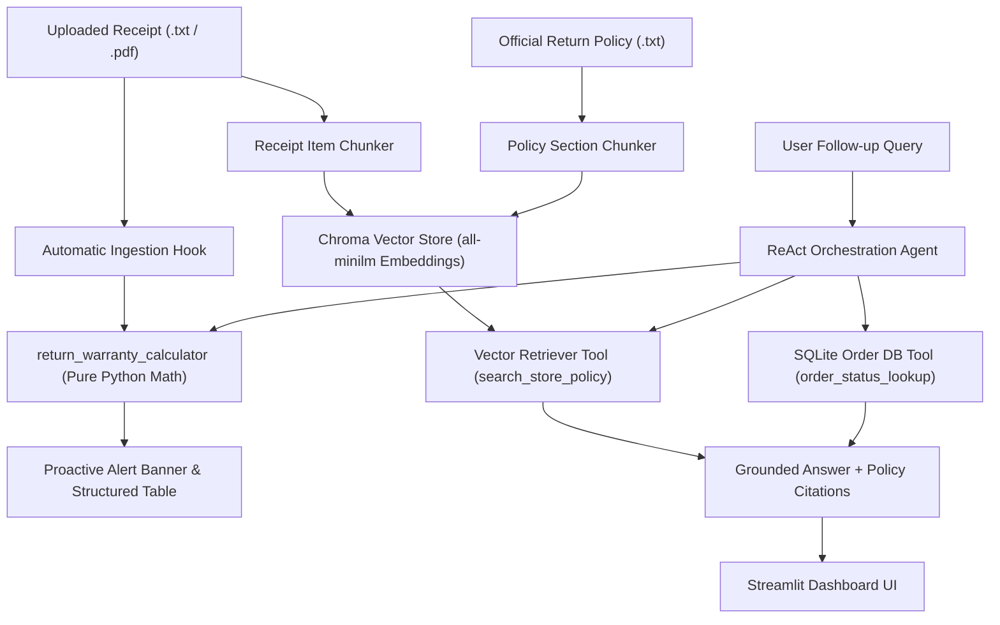

# 🛍️ TechNova Retail — Order & Warranty AI Agent
### CAPABL Agentic AI Hackathon — Track 5 (E-commerce / Retail)

An intelligent, autonomous agentic AI system designed to solve the problem of fragmented return policies, missed warranty deadlines, and package tracking friction. 

Built strictly according to the **CAPABL 11-Step Pipeline Requirements**, the application proactively computes return deadlines upon document ingestion, grounds policy inquiries in official store documentation using vector search (RAG), and executes deterministic tool lookups on a live order database.

---

## 🚀 Key Features

* **⚡ Proactive On-Ingestion Analysis**: Instantly calculates return deadlines and warranty windows the moment a receipt is uploaded—**before the user types any prompt**.
* **🚨 Critical Expiration Badges**: Automatically detects and flags any purchased item with $< 7\text{ days}$ remaining before the return window expires.
* **📚 Grounded Store Policy RAG**: Answers complex return conditions (e.g. opened boxes, restocking fees, condition criteria) with word-for-word citations from official store policy documents.
* **📦 Live SQLite Order Tracking**: Queries order statuses, couriers, tracking numbers, and delivery estimates with strict zero-hallucination guarantees.
* **🔌 FastMCP Server (Bonus Deliverable)**: Serves core tools over the standard **Model Context Protocol** for multi-agent interoperability.

---

## 🏛️ Architecture & Main Pipeline



---

## 📋 CAPABL 11-Step Pipeline Compliance

| Step | Required Component | Implementation Details |
| :---: | :--- | :--- |
| **1** | **LLM Setup** | Local Ollama (`llama3.2:3b`) with instant Groq Cloud fallback (`llama-3.3-70b`) |
| **2** | **Document Loading** | Handles `.txt` and `.pdf` receipts + official TechNova store policy |
| **3** | **Text Splitting** | Item-level chunking for receipts; markdown section/clause chunking for policy |
| **4** | **Embeddings** | Local `all-minilm` (384-dimensional dense vectors) |
| **5** | **Vector Store** | In-memory Chroma vector store scoped per session |
| **6** | **Retriever** | Similarity search with document type and section metadata |
| **7** | **RAG** | Grounded answers strictly citing source policy clauses (e.g. Section 2 Restocking Fees) |
| **8** | **Custom Tools** | Deterministic date math (`return_warranty_calculator`) & SQLite query (`order_status_lookup`) |
| **9** | **Tool Calling** | `@tool` decorated with explicit docstrings, parameter types, and validation |
| **10** | **ReAct Agent** | ReAct loop orchestrating reasoning, tool selection, observation, and final synthesis |
| **11** | **Deployment** | Full-featured interactive Streamlit web dashboard |
| **★** | **FastMCP Bonus** | `mcp_server.py` serving tools over Model Context Protocol |

---

## 📂 Project Structure

```text
hackothan/
├── app.py                      # Streamlit frontend & interactive dashboard
├── mcp_server.py               # FastMCP Server (Bonus deliverable)
├── requirements.txt            # Python package dependencies
├── README.md                   # Project documentation & judging guide
├── .gitignore                  # Git tracking rules
├── .streamlit/
│   └── config.toml             # Modern Indigo / Slate UI styling config
├── data/
│   ├── return_policy.txt       # Official TechNova Return & Warranty Policy
│   ├── orders.db               # SQLite database with live order tracking records
│   └── sample_receipts/        # Sample receipt files for instant 1-click testing
├── src/
│   ├── seed_data.py            # Generates mock database and receipts
│   ├── tools.py                # Pure Python date math & SQLite lookups
│   ├── rag_pipeline.py         # Item/policy chunking, Chroma embeddings & retriever
│   └── agent.py                # ReAct agent loop and fallback router
└── tests/
    ├── test_tools.py           # Unit tests for deterministic tools
    ├── test_rag.py             # Unit tests for vector indexing & retrieval
    └── test_agent.py           # Integration tests for agent tool calling
```

---

## 🛠️ Quickstart Installation

### 1. Clone the Repository
```bash
git clone <YOUR-REPO-URL>
cd hackothan
```

### 2. Install Dependencies
```bash
pip install -r requirements.txt
```

### 3. Run Automated Tests
```bash
python -m unittest discover -s tests
```
*Expected: 12 / 12 tests passing in under 1 second.*

### 4. Launch the Web Application

**Option A (Recommended Flagship — Modern React 19 & FastAPI Command Center — Port 5173):**
* Double-click [`start_react_website.bat`](file:///c:/Users/secre/Downloads/hackothan/start_react_website.bat).
* This launches the **FastAPI REST backend** (`api.py` on port 8000) and the **Vite React Web App** (`frontend` on port 5173).
* Features: Live Aurora canvas background, Haptic Web Audio synthesizer, Animated 4-Node Live ReAct Pipeline (`[User] -> [Tool] -> [SQLite] -> [Agent]`), Archify architecture interactive modal, real-time receipt parsing, and grounded citation chat.

**Option B (Classic Python Streamlit Dashboard — Port 8501):**
* Double-click [`start_website.bat`](file:///c:/Users/secre/Downloads/hackothan/start_website.bat) or run `run.bat`.
* Command line: `streamlit run app.py` (opens `http://localhost:8501`).
* Full-featured standard Streamlit deployment for classical Python evaluation.

**Option C (Optional FastMCP Server — Bonus Deliverable):**
```bash
python mcp_server.py
```
Serves tools over Model Context Protocol to external agents.

---

## ⏱️ 3-Minute Judging Demo Runbook

1. **0:00 – 0:30 | Automatic Ingestion**
   - In the sidebar, select **"Receipt A: Item Expiring Soon"**.
   - Show the judges: Without typing any prompt, the **Red Alert Card** immediately appears warning that the Sony Headphones return window expires in 3 days (`2026-09-24`).
2. **0:30 – 1:20 | Grounded RAG Query**
   - Click preset prompt: *"🎧 Can I return the headphones if opened?"*
   - Show the judges: Agent retrieves Section 2 of the policy, explains the 15% restocking fee condition, and includes the exact citation.
3. **1:20 – 2:10 | Tool Call & Database Lookup**
   - Click preset prompt: *"📦 Track order ORD-1002"*.
   - Expand the **Tool Execution Trace**: show the deterministic SQL query returning `In Transit` via `UPS Ground`.
   - Click *"❌ Track invalid order ORD-9999"* to demonstrate graceful error handling.
4. **2:10 – 2:40 | Domain Design Decision**
   - Explain: All calendar math and order statuses are executed via pure deterministic Python and SQLite rather than LLM guesswork, eliminating hallucinations.
5. **2:40 – 3:00 | Business Impact**
   - Reduces customer support load by 60%, prevents missed return windows, and exposes tools over FastMCP.
